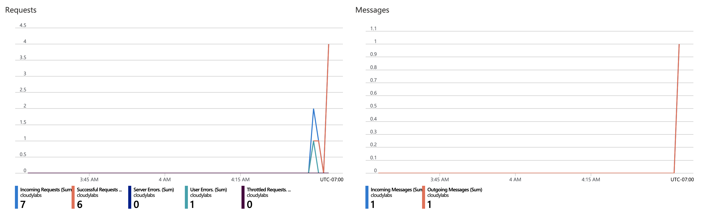
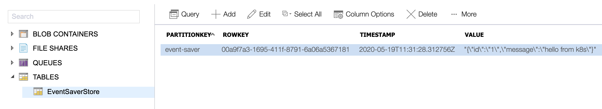

# ACI Deployment 

This document will overview the sample app deployment into Azure Container Instances (ACI).

## Prerequisite

* [Azure CLI](https://docs.microsoft.com/en-us/cli/azure/install-azure-cli?view=azure-cli-latest)

Also, to simplify all the scripts in this doc, set a few `az` CLI defaults:

```shell
az account set --subscription <id or name>
az configure --defaults location=<prefered location> group=<your resource group>
```

## Backing Services 

The setup of the backing services is beyond the scope of this document but you can find detail instructions on how to configure Azure services for state and pub/sub below:

* [State store configure with Azure Table Storage](https://docs.microsoft.com/en-us/azure/storage/common/storage-account-create?tabs=azure-portal). 
* [PubSub topic configure using Azure Service Bus](https://docs.microsoft.com/en-us/azure/service-bus-messaging/service-bus-quickstart-topics-subscriptions-portal).


## Setup

To deploy Dapr into ACI you will need to first create a storage for Dapr components. 

> Storage account name needs to be unique, 3-24 chars long, and containing only alphanumerics. You may need to update the bellow `SANAME` variable 

```shell
export SANAME="eventmakeraci"
```

From withing the [deployment/aci](deployment/aci) directory, first, create a storage account

> assumes your resource group and location defaults are already set 

```shell
az storage account create --name $SANAME --sku Standard_LRS
```

Create a file share

```shell
az storage share create --name components --account-name $SANAME
```

Upload the Dapr component files

```shell
az storage file upload --account-name $SANAME --share-name components --source component/store.yaml
az storage file upload --account-name $SANAME --share-name components --source component/topic.yaml
```

Capture storage key

```shell
az storage account keys list --account-name $SANAME --query "[0].value" --output tsv
```

Now update `volumes[components].azureFile.storageAccountKey` in [app-with-dapr.yaml](./app-with-dapr.yaml) file so that ACI can mount it

## Deployment

Once the storage is set up, you can deploy the app as many time as you need

```shell
az container create -f app-with-dapr.yaml --only-show-errors
```

The result should look something like this 

```shell
az container list -o table
Name         ResourceGroup    Status     Image                                                                                                             IP:ports           Network    CPU/Memory       OsType    Location
-----------  ---------------  ---------  ----------------------------------------------------------------------------------------------------------------  -----------------  ---------  ---------------  --------  ----------
event-saver  dev_machmarn     Succeeded  daprio/daprd@sha256:59a3ffaa482655ccdf51e4be1bddb744584ed246aeb370c5daa3048c1947d1c1,mchmarny/event-saver:v0.1.5  52.250.32.80:3500  Public     1.0 core/1.5 gb  Linux     westus2
```

Than just capture the IP for ease of access 

```shell
export APP_IP=$(az container show -n event-saver --query "ipAddress.ip" -o tsv)
```

If everything went OK, you should be able to access the user service thru Dapr API 

```shell
curl -H "Content-Type: application/json" \
    "http://${APP_IP}:3500/v1.0/invoke/event-saver/method/"
```

Response should look something like this (notice the localhost service invocation)

```json
{ "requestor": "127.0.0.1:8080", "version": "v0.1.5" }
```

> Note, the direct access to the user service is disabled. Uncomment `- port: 8080` in `ports` section of [./app-with-dapr.yaml](./app-with-dapr.yaml) to enable it 

To view logs from the Dapr container 

```shell
az container logs --name event-saver --container-name daprd
```

## Demo 

Post some content unto the topic 

```shell
# print verbose since the publish post doesn't return any content
curl -v -H "Content-Type: application/json" \
    "http://${APP_IP}:3500/v1.0/publish/events" \
    -d '{ "id": "33", "message": "hi from aci" }'
```

The response should include success status code `HTTP/1.1 200 OK`


## Data

To view the data, first navigate to Service Bus topic in Azure Portal and see the message delivery count



Similarly, navigate to Storage Account section of the Azure Portal and see the event content saved into the table store 



> for readability during demo, the JSON messages are saved in the state store as strings

That's it, I hope you found it helpful. 

## Clean up 

```shell
az container delete -n event-saver -y
```

## Next

## Next

* [Kubernates](../../deployment/k8s)

## Disclaimer

This is my personal project and it does not represent my employer. I take no responsibility for issues caused by this code. I do my best to ensure that everything works, but if something goes wrong, my apologies is all you will get.

## License
This software is released under the [Apache v2 License](../../LICENSE) 

